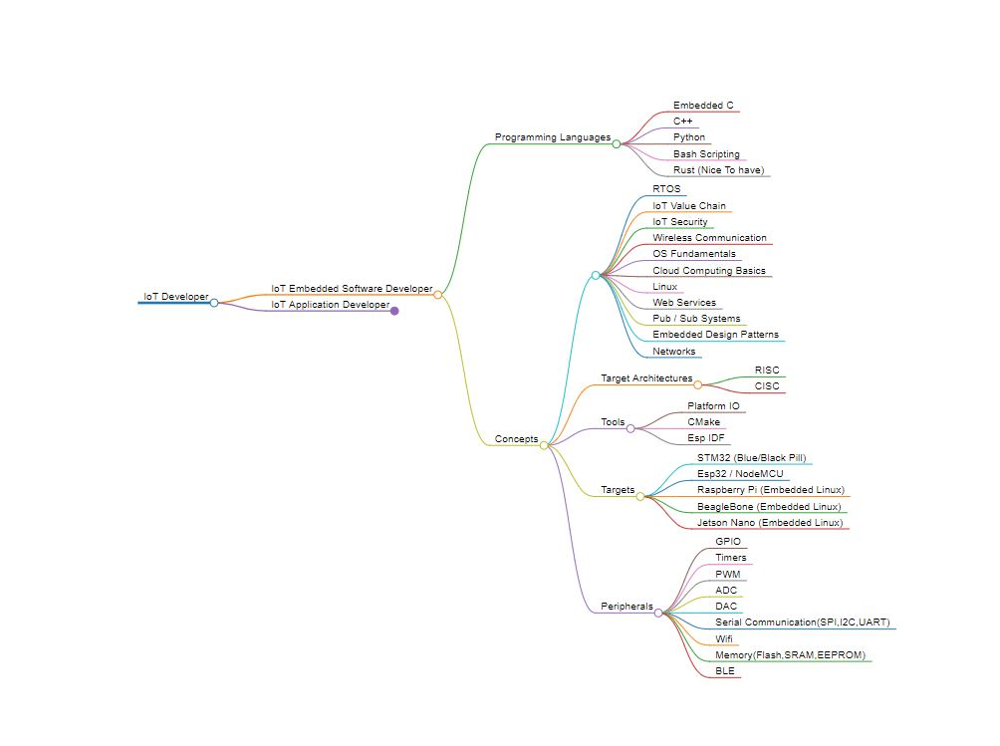
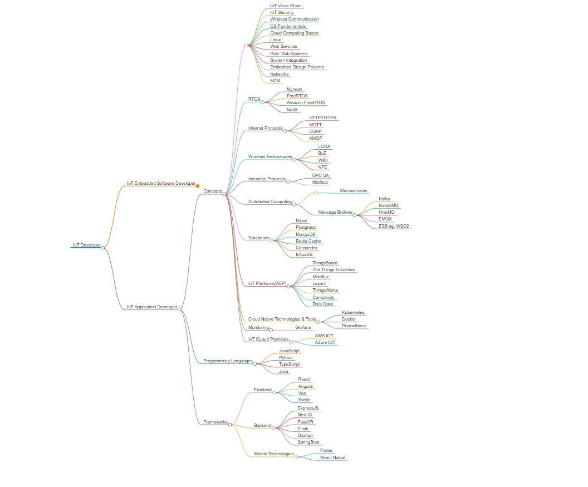

# Road To become an IoT Developer ✔️

I have split this post to 2 road ways :

- Embedded IoT Developer 🧑‍💻
- IoT Application Developer 🧑‍💻

The Way the road maps are structured are as follows:

- Programming Languages
- Concepts
- Tools

## Embedded IoT Developer

### Programming Languages 💻:

- Embedded C (Must Have)
- C++ (Must Have)
- Python (Must Have)
- Bash Scripting (Nice To have)
- Rust (Nice To have)

Those Programming Languages are going to give you a head start to kickstart the embedded journey where C++ and Embedded C are
the bare minimum to get started

#### Concepts 🧠:

- RTOS (Must Have)
- IoT Value Chain (Must Have)
- IoT Security (Nice To Have)
- Wireless Communication (Must Have)
- OS Fundamentals (Must Have)
- Cloud Computing Basics (Nice To Have)
- Linux (Must Have)
- Web Services (Nice To Have)
- Pub / Sub Systems (Must Have)
- Embedded Design Patterns (Must Have)
- Networks (Nice To Have)

These Concepts are mandatory in order to be able to work comfortablly developing IoT Solutions.

### Tools 🧰:

- Platform IO
- CMake
- Esp IDF

### Target Architectures

- RISC
- CISC

The difference between CISC and RISC Targets should be understandable during development of Embedded IoT Solutions

You Can try the Following Targets / Dev Boards:

#### Targets

- STM32 (Blue/Black Pill)
- Esp32 / NodeMCU
- Raspberry Pi (Embedded Linux)
- BeagleBone (Embedded Linux)
- Jetson Nano (Embedded Linux)

To Work with those Targets and get something useful out of them you have to understand the target peripherals which include the following:

#### Microcontoller Peripherals 🎮

- GPIO
- Timers
- PWM
- ADC
- DAC
- Serial Communication(SPI,I2C,UART)
- Wifi
- Memory(Flash,SRAM,EEPROM)
- BLE

### Here is a High Level Mindmap 🗺️:

## IoT Application Developer

For you to become an iot application developer you have to wear a lot of hats and be knowledgable in alot of things ,
you should not think that you have to expert at all of these but atleast have some idea on how to work with the following:

- Frontend
- Backend
- Cross Platform Mobile Development (Nice To have)

you can choose from the below frameworks whatever you feel comfortable working with or have worked with before.

### Programming Languages 💻:

- TypeScript
- JavaScript
- Python
- Java

### Frameworks

#### Frontend

- React
- Angular
- Vue
- Svelte

#### Backend

- ExpressJS
- NestJS
- FastAPI
- Flask
- DJango
- SpringBoot
- GO

#### Mobile Technologies

- Flutter
- React Native

### Concepts 🧠

- IoT Value Chain
- IoT Security
- Wireless Communication
- OS Fundamentals
- Cloud Computing Basics
- Linux
- Web Services
- Pub / Sub Systems
- System Integration
- Networks
- M2M
- Design Patterns

For Realtime operating systems you just have to understand how they work and how to deal with event loops because you can work with one.

### RTOS

- Mynewt
- FreeRTOS
- Amazon FreeRTOS
- NuttX

For Internet Protocols they are mandatory that you understand how they work with different Architectures,
for example client / server or pub / sub systems

### Internet Protocols

- HTTP/HTTPS
- MQTT
- COAP
- AMQP

### Wireless Technologies

- LORA
- BLE
- WIFI
- NFC
  Industrial protocols are not mandatory but they are nice to have and to understand how they work and if you want to work in the
  IIOT space then they will become very important and give you a headstart.

### Industrial Protocols

- OPC UA
- Modbus

### Distributed Computing

You should at least know one of the following message brokers to implement distributed computing and asynchronous code execution

- Microservices

##### Message Brokers

- Kafka
- RabbitMQ
- HiveMQ
- EMQX
- ESB eg. WSO2

You have to know atleast one Relational database, one nosql database and one Timeseries database as well as keystore databases.

### Databases

- Mysql
- Postgresql
- MongoDB
- Cassandra
- Redis Cache
- InfluxDB

Time to market is really important to Enterprise companies that's why the use Application Enablement Platform,
where they can develop iot solutions faster and below are the most popular ones in the market varying from open source to fully paid solutions

### IoT Platforms(AEP)

- ThingsBoard
- The Things Industries
- Mainflux
- ThingsWorx
- Losant
- ThingsWorks
- Cumulocity
- Data Cake

### Cloud Native Technologies & Tools 🧰

- Kubernetes
- Docker
- Prometheus

#### Monitoring 🖥️

Monitoring your assets and applications and servers is key to successful IoT deployment and maintenance Grafana is one of the best monitoring and
visualization tools

- Grafana

### IoT CLoud Providers

There are two types of AEPs One we call as _Application enablement platform_ and one we call as _Hyperscalers_, Amazon and Microsoft are conisdered as Market Hyperscalers
who enter the cloud and iot space to provide premade services to accelarate your time to market and development cycle

- AWS IOT
- AZure IOT

### Here is a High Level Mindmap 🗺️:

